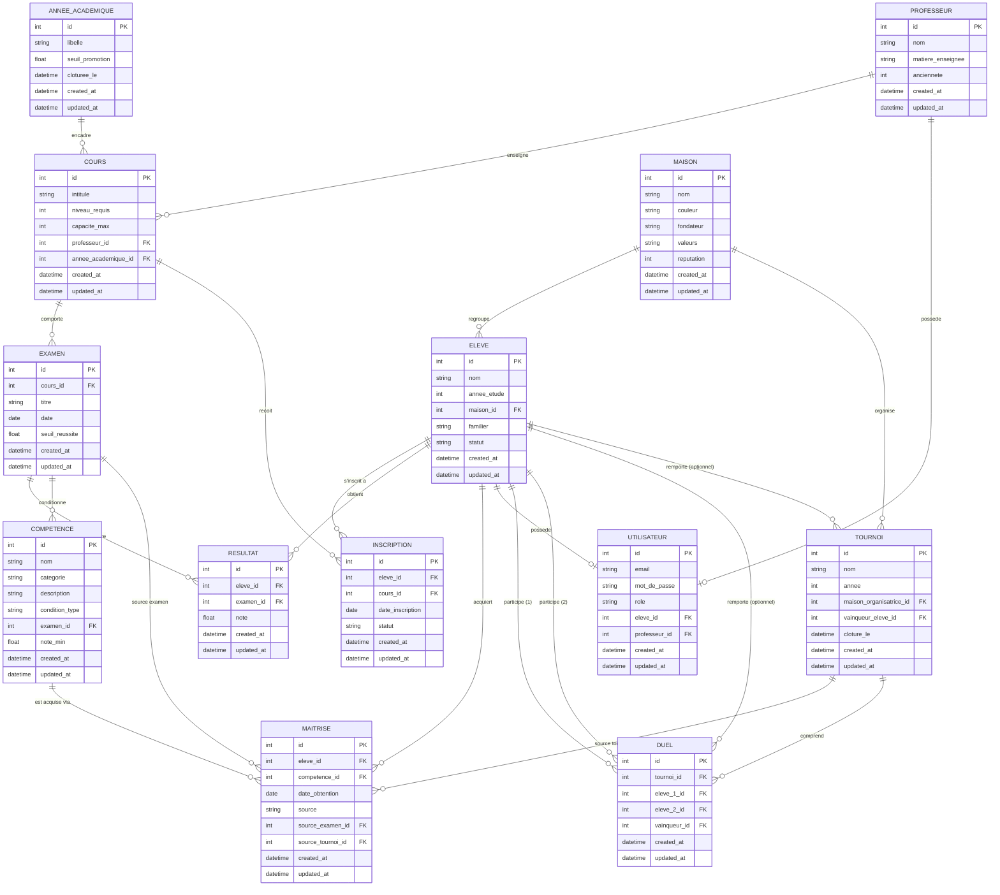

# Modèle de données — L'Académie de Sorcellerie

Ce document décrit le modèle relationnel qui couvre l'ensemble du projet (jours 1 à 4). Il est pensé comme un support de départ, pas comme un corrigé à recopier : les noms de champs, les types et certains choix de normalisation peuvent être adaptés tant que les règles métier du cahier des charges restent respectées.

Le diagramme complet est en fin de document. Un fichier séparé `schema-bdd-academie-sorcellerie.mermaid` contient le même diagramme si vous préférez l'ouvrir directement dans un visualiseur Mermaid.

## Pourquoi 13 tables et pas moins

Trois relations du cahier des charges sont des associations N-N *enrichies* : Élève↔Cours (via Inscription), Élève↔Examen (via Résultat), Élève↔Compétence (via Maîtrise). Une association enrichie porte des attributs propres (une date, un statut, une note) — elle ne peut donc pas être une simple table de jointure à deux colonnes, elle a besoin de son propre identifiant. C'est la première décision de modélisation du projet, et c'est celle qui structure tout le reste.

## Vue d'ensemble des entités

| Entité | Rôle |
|---|---|
| Maison | Regroupe les élèves et porte un score de réputation |
| Professeur | Enseigne un ou plusieurs cours |
| AnneeAcademique | Représente une année scolaire (2025-2026, etc.) et son seuil de passage |
| Cours | Unité d'enseignement rattachée à un professeur et une année |
| Eleve | Élève de l'Académie, rattaché à une maison |
| Utilisateur | Compte de connexion, optionnellement lié à un Élève ou un Professeur |
| Inscription | Association enrichie Élève↔Cours |
| Examen | Évaluation rattachée à un cours |
| Resultat | Association enrichie Élève↔Examen (la note) |
| Competence | Catalogue des compétences magiques débloquables |
| Maitrise | Association enrichie Élève↔Compétence (le déblocage) |
| Tournoi | Compétition inter-maisons |
| Duel | Affrontement entre deux élèves au sein d'un tournoi |

## Dictionnaire de données

### Maison

| Champ | Type | Contrainte | Note |
|---|---|---|---|
| id | int | PK | |
| nom | string | unique, not null | |
| couleur | string | not null | |
| fondateur | string | not null | |
| valeurs | string | | texte libre ou liste |
| reputation | int | not null, défaut 0 | incrémentée à la clôture d'un tournoi |
| created_at | datetime | not null | |
| updated_at | datetime | not null | |

### Professeur

| Champ | Type | Contrainte | Note |
|---|---|---|---|
| id | int | PK | |
| nom | string | not null | |
| matiere_enseignee | string | not null | |
| anciennete | int | not null | en années |
| created_at | datetime | not null | |
| updated_at | datetime | not null | |

### AnneeAcademique

| Champ | Type | Contrainte | Note |
|---|---|---|---|
| id | int | PK | |
| libelle | string | unique, not null | ex. "2025-2026" |
| seuil_promotion | float | not null | moyenne minimale pour passer à l'année suivante |
| cloturee_le | datetime | nullable | rempli une seule fois, au passage de fin d'année |
| created_at | datetime | not null | |
| updated_at | datetime | not null | |

Cette table n'est pas explicitement demandée par le cahier des charges au jour 1, mais elle règle deux problèmes qui apparaissent au jour 4 : où stocker le seuil de promotion configurable, et comment refuser un second rejeu de la clôture d'année sans passer par un champ isolé quelque part. `cloturee_le` rempli = année déjà clôturée = 409 sur toute nouvelle tentative. Une alternative plus simple consiste à garder `annee_academique` comme simple chaîne sur `Cours` et à gérer la clôture dans une table à part ; les deux approches sont défendables, celle-ci évite une chaîne dupliquée sur chaque cours.

### Cours

| Champ | Type | Contrainte | Note |
|---|---|---|---|
| id | int | PK | |
| intitule | string | not null | |
| niveau_requis | int | not null | |
| capacite_max | int | not null | |
| professeur_id | int | FK → Professeur.id, not null | |
| annee_academique_id | int | FK → AnneeAcademique.id, not null | |
| created_at | datetime | not null | |
| updated_at | datetime | not null | |

### Eleve

| Champ | Type | Contrainte | Note |
|---|---|---|---|
| id | int | PK | |
| nom | string | not null | |
| annee_etude | int | not null, entre 1 et 7 | |
| maison_id | int | FK → Maison.id, not null | |
| familier | string | nullable | |
| statut | enum | not null | actif / diplome / renvoye |
| created_at | datetime | not null | |
| updated_at | datetime | not null | |

La diplomation ne supprime pas la ligne : `statut` passe à `diplome`, le dossier reste lisible. C'est le point que le cahier des charges appelle « archivage, pas suppression ».

### Utilisateur

| Champ | Type | Contrainte | Note |
|---|---|---|---|
| id | int | PK | |
| email | string | unique, not null | |
| mot_de_passe | string | not null | en clair pour l'instant — à annoter comme temporaire dans le code |
| role | enum | not null | eleve / professeur / admin |
| eleve_id | int | FK → Eleve.id, nullable | rempli seulement si role = eleve |
| professeur_id | int | FK → Professeur.id, nullable | rempli seulement si role = professeur |
| created_at | datetime | not null | |
| updated_at | datetime | not null | |

Le cahier des charges precise que cette règle peut rester une contrainte applicative. Elle peut aussi être doublée d'une contrainte `CHECK` en base (`role = 'eleve' => eleve_id IS NOT NULL AND professeur_id IS NULL`, etc.) si votre SGBD le permet — cela évite qu'un bug de code ne produise un utilisateur admin avec un `eleve_id` orphelin.

### Inscription (association enrichie Eleve ↔ Cours)

| Champ | Type | Contrainte | Note |
|---|---|---|---|
| id | int | PK | |
| eleve_id | int | FK → Eleve.id, not null | |
| cours_id | int | FK → Cours.id, not null | |
| date_inscription | date | not null | |
| statut | enum | not null | inscrit / en_cours / valide / abandonne |
| created_at | datetime | not null | |
| updated_at | datetime | not null | |

Contrainte unique sur `(eleve_id, cours_id)` : un élève ne s'inscrit qu'une fois au même cours. La vérification de capacité maximale (compter les inscriptions actives d'un cours avant d'en accepter une nouvelle) est une règle applicative, pas une contrainte de schéma — la base ne peut pas connaître `capacite_max` au moment de l'insertion sans un trigger.

### Examen

| Champ | Type | Contrainte | Note |
|---|---|---|---|
| id | int | PK | |
| cours_id | int | FK → Cours.id, not null | |
| titre | string | not null | |
| date | date | not null | |
| seuil_reussite | float | not null | |
| created_at | datetime | not null | |
| updated_at | datetime | not null | |

### Resultat (association enrichie Eleve ↔ Examen)

| Champ | Type | Contrainte | Note |
|---|---|---|---|
| id | int | PK | |
| eleve_id | int | FK → Eleve.id, not null | |
| examen_id | int | FK → Examen.id, not null | |
| note | float | not null, bornée (ex. 0-20) | la borne haute dépend de votre barème |
| created_at | datetime | not null | |
| updated_at | datetime | not null | |

Contrainte unique sur `(eleve_id, examen_id)` : une seule note par élève et par examen (la saisie en masse doit faire un upsert, pas un insert brut, si l'endpoint est rappelé).

### Competence

| Champ | Type | Contrainte | Note |
|---|---|---|---|
| id | int | PK | |
| nom | string | not null | |
| categorie | string | not null | sorts offensifs / défensifs / potions / divination / métamorphose... |
| description | string | not null | |
| condition_type | enum | not null | examen / tournoi |
| examen_id | int | FK → Examen.id, nullable | rempli seulement si condition_type = examen |
| note_min | float | nullable | rempli seulement si condition_type = examen |
| created_at | datetime | not null | |
| updated_at | datetime | not null | |

### Maitrise (association enrichie Eleve ↔ Competence)

| Champ | Type | Contrainte | Note |
|---|---|---|---|
| id | int | PK | |
| eleve_id | int | FK → Eleve.id, not null | |
| competence_id | int | FK → Competence.id, not null | |
| date_obtention | date | not null | |
| source | enum | not null | examen / tournoi |
| source_examen_id | int | FK → Examen.id, nullable | rempli seulement si source = examen |
| source_tournoi_id | int | FK → Tournoi.id, nullable | rempli seulement si source = tournoi |
| created_at | datetime | not null | |
| updated_at | datetime | not null | |

Contrainte unique sur `(eleve_id, competence_id)` : c'est elle qui garantit l'idempotence demandée au jour 3 (relancer l'évaluation des compétences débloquées ne doit jamais dupliquer une maîtrise déjà acquise). Notez que `source_examen_id` et `source_tournoi_id` sont deux colonnes nullables plutôt qu'une seule colonne générique de type "référence polymorphe" (`source_type` + `source_id` sans contrainte de clé étrangère) : ça coûte une colonne de plus, mais ça reste vérifiable par la base de données. Une clé étrangère générique ne l'est pas.

### Tournoi

| Champ | Type | Contrainte | Note |
|---|---|---|---|
| id | int | PK | |
| nom | string | not null | |
| annee | int | not null | |
| maison_organisatrice_id | int | FK → Maison.id, nullable | facultatif |
| vainqueur_eleve_id | int | FK → Eleve.id, nullable | rempli à la clôture |
| cloture_le | datetime | nullable | même logique de garde qu'`AnneeAcademique.cloturee_le` |
| created_at | datetime | not null | |
| updated_at | datetime | not null | |

### Duel

| Champ | Type | Contrainte | Note |
|---|---|---|---|
| id | int | PK | |
| tournoi_id | int | FK → Tournoi.id, not null | |
| eleve_1_id | int | FK → Eleve.id, not null | |
| eleve_2_id | int | FK → Eleve.id, not null | |
| vainqueur_id | int | FK → Eleve.id, nullable | rempli une fois le duel joué |
| created_at | datetime | not null | |
| updated_at | datetime | not null | |

Vérifiez en code que `eleve_1_id ≠ eleve_2_id` et que `vainqueur_id` (s'il est rempli) vaut l'un des deux — ce sont des contraintes qu'un `CHECK` SQL peut exprimer, mais qui restent simples à valider côté application avec votre bibliothèque de validation du jour 4.

## Relations et cardinalités

| Entité source | Cardinalité | Entité cible | Cardinalité | Signification |
|---|---|---|---|---|
| AnneeAcademique | 1,1 | Cours | 0,n | une année encadre plusieurs cours |
| Maison | 1,1 | Eleve | 0,n | une maison regroupe plusieurs élèves |
| Maison | 0,1 | Tournoi | 0,n | une maison organise éventuellement des tournois |
| Professeur | 1,1 | Cours | 0,n | un professeur est responsable de plusieurs cours |
| Cours | 1,1 | Examen | 0,n | un cours comporte plusieurs examens |
| Eleve | 1,1 | Inscription | 0,n | un élève a plusieurs inscriptions |
| Cours | 1,1 | Inscription | 0,n | un cours reçoit plusieurs inscriptions |
| Eleve | 1,1 | Resultat | 0,n | un élève obtient plusieurs résultats |
| Examen | 1,1 | Resultat | 0,n | un examen génère un résultat par élève inscrit |
| Eleve | 1,1 | Maitrise | 0,n | un élève acquiert plusieurs maîtrises |
| Competence | 1,1 | Maitrise | 0,n | une compétence est acquise par plusieurs élèves |
| Examen | 0,1 | Competence | 0,n | un examen peut conditionner plusieurs compétences |
| Examen | 0,1 | Maitrise | 0,n | une maîtrise peut venir d'un examen (source) |
| Tournoi | 0,1 | Maitrise | 0,n | une maîtrise peut venir d'un tournoi (source) |
| Eleve | 0,1 | Utilisateur | 0,1 | un élève a au plus un compte utilisateur |
| Professeur | 0,1 | Utilisateur | 0,1 | un professeur a au plus un compte utilisateur |
| Tournoi | 1,1 | Duel | 0,n | un tournoi comprend plusieurs duels |
| Eleve | 1,1 | Duel (eleve_1) | 0,n | un élève participe à plusieurs duels en position 1 |
| Eleve | 1,1 | Duel (eleve_2) | 0,n | un élève participe à plusieurs duels en position 2 |
| Eleve | 0,1 | Duel (vainqueur) | 0,n | un élève remporte éventuellement des duels |
| Eleve | 0,1 | Tournoi (vainqueur) | 0,n | un élève remporte éventuellement des tournois |

## Diagramme

## Points à valider avant de coder

Ce modèle répond aux règles du cahier des charges, mais trois décisions restent ouvertes à discussion en équipe :

Le format de `AnneeAcademique` — table dédiée ou simple champ texte sur `Cours` — n'est pas imposé par l'énoncé. La table dédiée est proposée ici parce qu'elle donne un endroit naturel où stocker le seuil de promotion et la marque de clôture, mais un champ texte fonctionne aussi si vous gérez la garde anti-rejeu autrement (par exemple une table `ClotureAnnee` séparée).

Les deux colonnes nullables sur `Maitrise` (`source_examen_id` / `source_tournoi_id`) coûtent un peu d'espace mais gardent une intégrité référentielle vérifiable par la base. Si votre équipe préfère une seule colonne générique, assumez que la vérification d'intégrité se fera uniquement en code.

Les contraintes `unique` mentionnées dans ce document (`Inscription(eleve_id, cours_id)`, `Resultat(eleve_id, examen_id)`, `Maitrise(eleve_id, competence_id)`) sont ce qui rend vos opérations de clôture idempotentes au niveau base de données, en plus de la logique applicative. Ne les oubliez pas dans vos modèles SQLAlchemy — c'est un filet de sécurité qui coûte une ligne de code et qui évite un doublon en production.
